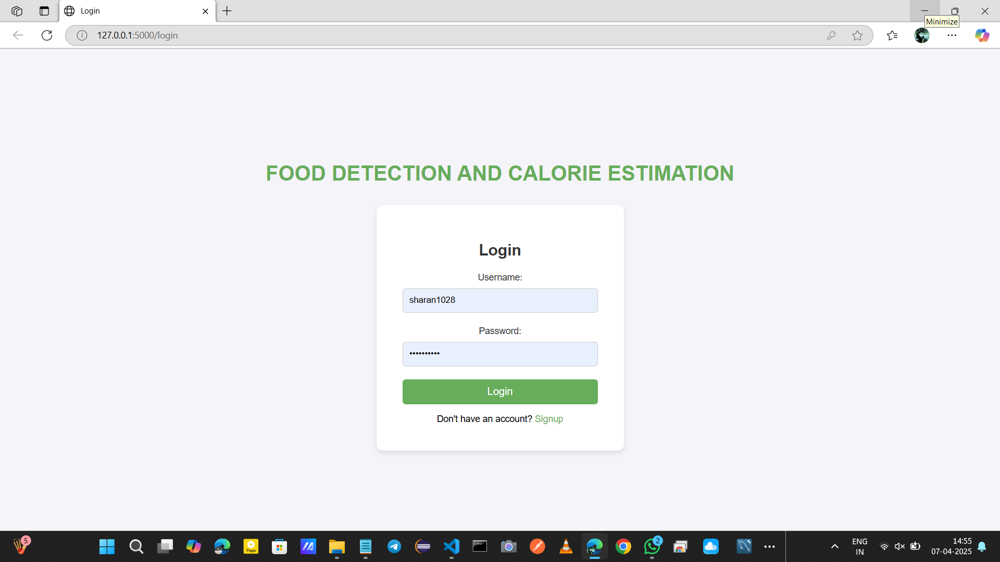
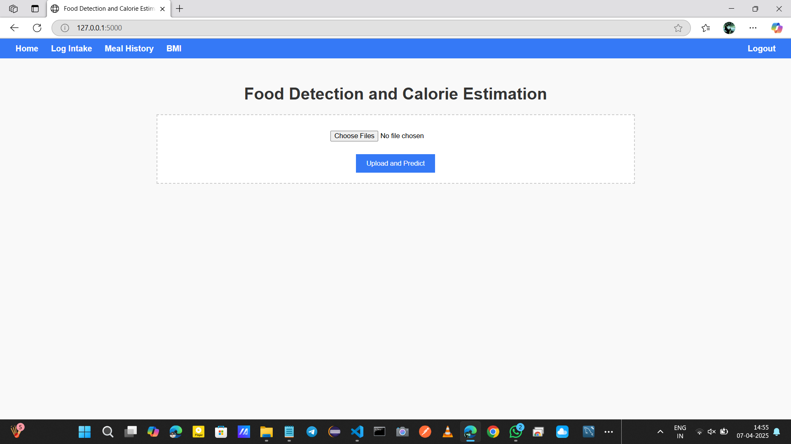
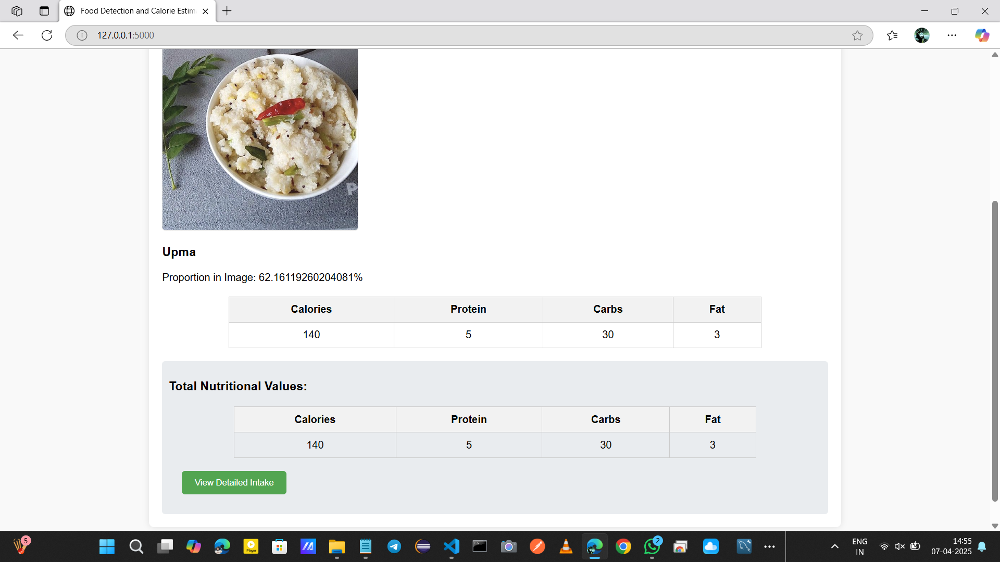
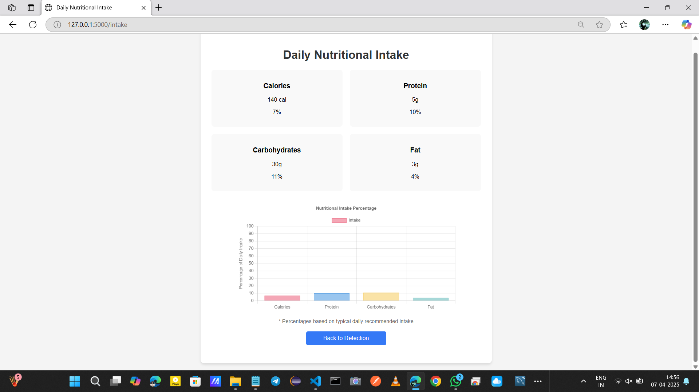
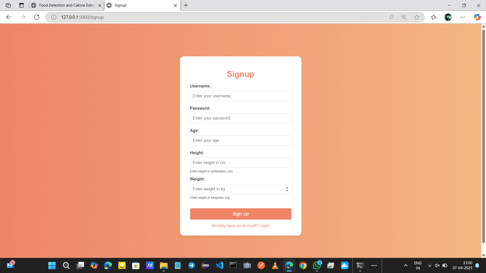

# 🍽️ Food Detection and Calorie Estimation Using Deep Learning

## 📌 Overview

This project is a Deep Learning and Computer Vision-based web application that detects food items from images and estimates their calorie values. It helps users monitor their daily calorie intake and supports healthy dietary habits.

The application is developed using Python, TensorFlow, Keras, Flask, and OpenCV.

---

## 🚀 Features

- 🍔 Detects food items from uploaded images
- 🔍 Uses Deep Learning for food classification
- 🔥 Estimates calorie values
- 👤 User Login & Registration
- 📊 Meal History Tracking
- 💻 Flask-based Web Interface

---

## 🛠️ Technologies Used

- Python
- TensorFlow
- Keras
- OpenCV
- Flask
- HTML
- CSS
- SQLite
- Jupyter Notebook

---

## 📂 Project Structure

```
Food-Calorie-Estimation-Using-Deep-Learning
│
├── app.py
├── requirements.txt
├── efficientnet_model.ipynb
├── Templates/
├── uploads/
├── tests/
├── instance/
└── README.md
```

---

## ⚙️ Installation

Clone the repository

```bash
git clone https://github.com/sharan-1028/Food-Calorie-Estimation-Using-Deep-Learning.git
```

Install dependencies

```bash
pip install -r requirements.txt
```

Run the application

```bash
python app.py
```

---

## 📸 Screenshots

### 🔐 Login Page


---

### 🏠 Home Page


---

### 📊 Prediction Result


---

### 📈 Daily Nutritional Intake


---

### 📝 Signup Page


---

## 📈 Future Improvements

- Real-time food detection
- Mobile application
- Nutritional recommendations
- Multi-food detection
- Cloud deployment

---

## 📌 Note

The dataset and trained model are not included in this repository due to GitHub file size limitations.

---

## 👨‍💻 Author

**Kaveti Sharan**

- LinkedIn: https://www.linkedin.com/in/sharan-kaveti/
- GitHub: https://github.com/sharan-1028

---

⭐ If you like this project, consider giving it a Star.
